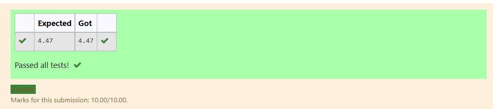

# DISTANCE-BETWEEN-TWO-POINTS

## AIM:
To write a python program to find the distance two 2 points
## ALGORITHM:
### Step 1: 
Get the two list forom the user
### Step 2:
import the math module  
### Step 3: 
Substitute the values in the distance formula  
### Step 4: 
print the value useing the format function
### Step 5: 
Stop the program
### PROGRAM:
~~~  
import math
x=[10,6]
y=[4,2]
dist=math.sqrt(((x[0]-x[1])**2)+((y[0]+y[1])**2))
print("{:.2f}".format(dist))
~~~
### OUTPUT:

### RESULT:
Thus the python program is executed to find the distance of two 2 points